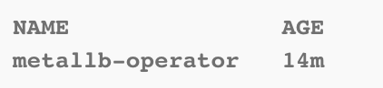
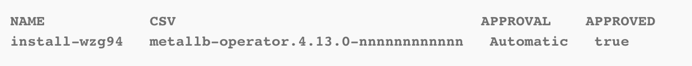
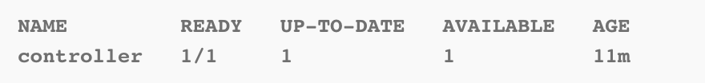

# Red-Hat-Open-Shift-MetalLB-Load-Balancer

En esta guía se presenta un paso a paso para desplegar un Load balancer MetalLB en un clúster de Openshift


## Contenido
1. [Pre-Requisitos](#pre-requisitos-pencil)
2. [Instalación del operador en Red Hat Openshift](#instalación-del-operador-en-red-hat-openshift-⚙️)
3. [Configuración de MetalLB](#configuración-de-metallb-⚖️)
5. [Configurar servicios para usar MetalLB](#restauración-de-un-backup-alojado-en-ibm-cloud-object-storage-📂)
4. [Referencias](#referencias-📄)
4. [Autores](#autores-black_nib)

## Pre-Requisitos :pencil:
- Contar con un clúster de Openshift en [IBM Cloud Satellite](https://cloud.ibm.com/kubernetes/catalog/create?platformType=openshift&catalog_query=aHR0cHM6Ly9jbG91ZC5pYm0uY29tL2NhdGFsb2c%2FY2F0ZWdvcnk9Y29udGFpbmVycw%3D%3D)
- Contar con una aplicación web desplegada en el clúster.

## Instalación del operador en Red Hat Openshift :gear:

1. Ingrese a IBM Cloud Shell con el comando de acceso de su clúster de openshift

2. Cree un namespace para el operador:

```
cat << EOF | oc apply -f -
apiVersion: v1
kind: Namespace
metadata:
  name: metallb-system
EOF
```

3. Cree un operator group custom resource (CR) en el mismo namespace:

```
cat << EOF | oc apply -f -
apiVersion: operators.coreos.com/v1
kind: OperatorGroup
metadata:
  name: metallb-operator
  namespace: metallb-system
EOF
```

4. Verifique la creación del operator group:

```
oc get operatorgroup -n metallb-system
```

Si fue creado de forma exitosa debería ver algo así:

 


5. Cree un custom resource para la suscripción:

```
cat << EOF | oc apply -f -
apiVersion: operators.coreos.com/v1alpha1
kind: Subscription
metadata:
  name: metallb-operator-sub
  namespace: metallb-system
spec:
  channel: stable
  name: metallb-operator
  source: redhat-operators 
  sourceNamespace: openshift-marketplace
EOF
```

6. Agregue un label al namespace para habilitar las métricas:

```
oc label ns metallb-system "openshift.io/cluster-monitoring=true"
```

7. Verifique la creación del plan de instalación:

```
oc get installplan -n metallb-system
```

Debería ver algo así:

 

8. Verifique que el operador haya sido instalado:

```
oc get clusterserviceversion -n metallb-system -o custom-columns=Name:.metadata.name,Phase:.status.phase
```

Deberá aparecer en estado **succeeded**


## Configuración de MetalLB :balance_scale:

1. Cree una instancia de MetalLB:

```
cat << EOF | oc apply -f -
apiVersion: metallb.io/v1beta1
kind: MetalLB
metadata:
  name: metallb
  namespace: metallb-system
EOF
```

2. Verifique que el controlador está funcionando:

```
oc get deployment -n metallb-system controller
```

Debería aparecer así:

 


3. Verifique que el daemonset está funcionando:

```
oc get daemonset -n metallb-system speaker
```

Deberían aparecer todos los speakers en estado **available**

4. Cree la address pool para el load balancer, esta se encargará de redireccionar las solicitudes según las IPs agregadas, por ejemplo:

```
cat << EOF | oc apply -f -
apiVersion: metallb.io/v1beta1
kind: IPAddressPool
metadata:
  namespace: metallb-system
  name: doc-example
  labels: 
    zone: east
spec:
  addresses:
  - 203.0.113.1-203.0.113.10
  - 203.0.113.65-203.0.113.75
EOF
```

5. Verifique la creación de su Address Pool:

```
oc describe -n metallb-system IPAddressPool doc-example
```

Si desea hacer una configuración mayor con las address pools, puede consultar la siguiente [documentación](https://docs.openshift.com/container-platform/4.13/networking/metallb/metallb-configure-address-pools.html#metallb-configure-address-pools)

## Configurar servicios para usar MetalLB :cloud: 

La última etapa del proceso consiste en configurar los servicios para usar el load balancer MetalLB. Para ello debe hacer dos modificaciones en el YAML del servicio que expone su aplicación:

1. Agregue una anotación donde incluya MetalLB y el nombre de su address pool:

```
  annotations:
    metallb.universe.tf/address-pool: <address_pool_name>
```

por ejemplo, si creó la address pool presentada en esta guía, el comando sería:

```
  annotations:
    metallb.universe.tf/address-pool: doc-example
```

2. En la sección **spec**, luego de la definición de puertos:

```
  type: LoadBalancer 
```

Luego de hacer estas dos modificaciones al YAML de su servicio, la aplicación debería estar expuesta por medio del balanceador de carga MetalLB.

Si desea hacer una configuración más detallada de sus servicios, puede consultar la siguiente [documentación](https://docs.openshift.com/container-platform/4.13/networking/metallb/metallb-configure-services.html#metallb-configure-services)

## Referencias :page_facing_up:
- [https://docs.openshift.com/container-platform/4.13/networking/metallb/metallb-operator-install.html](https://docs.openshift.com/container-platform/4.13/networking/metallb/metallb-operator-install.html)
- [https://cloud.ibm.com/docs/openshift?topic=openshift-sat-expose-apps](https://cloud.ibm.com/docs/openshift?topic=openshift-sat-expose-apps)


## Autores :black_nib:
Equipo IBM Cloud Tech Sales Colombia